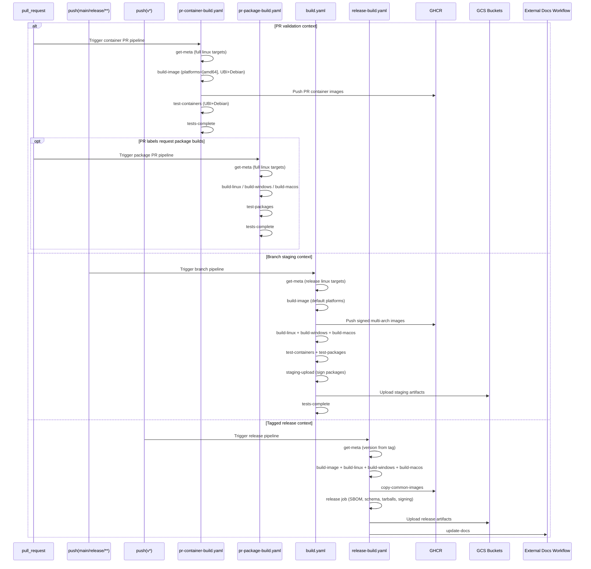
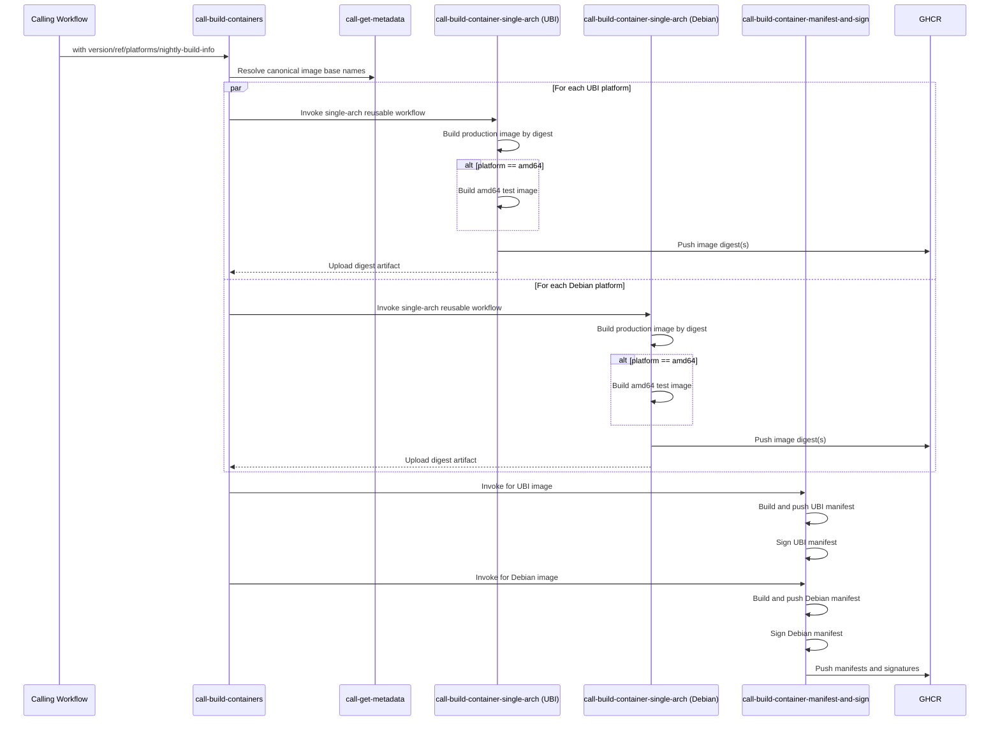
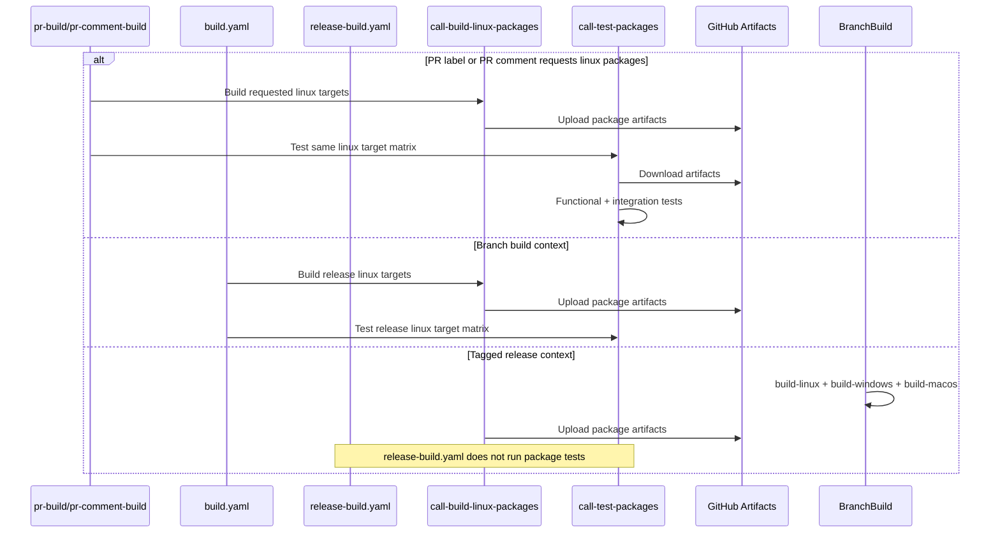
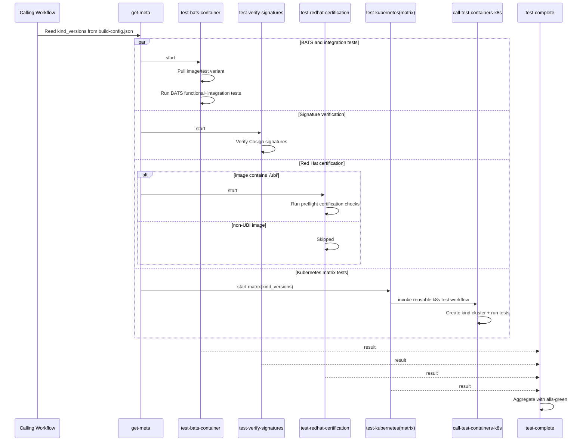
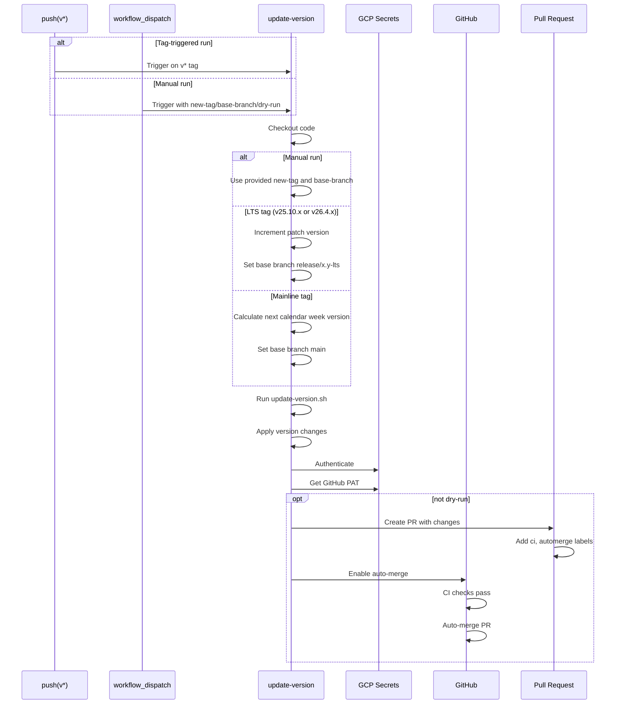

# GitHub Actions CI/CD Documentation

This directory contains the GitHub Actions workflows and reusable actions for the Agent project. The CI/CD pipeline automates building, testing, packaging, and releasing the agent across multiple platforms.

[](https://coveralls.io/github/telemetryforge/agent)

## Table of Contents

- [GitHub Actions CI/CD Documentation](#github-actions-cicd-documentation)
  - [Table of Contents](#table-of-contents)
  - [Overview](#overview)
  - [Workflows](#workflows)
    - [Filename Conventions](#filename-conventions)
    - [PR Container Build and Test](#pr-container-build-and-test)
    - [PR Package Build and Test](#pr-package-build-and-test)
    - [PR Comment Build](#pr-comment-build)
    - [Branch Build and Test](#branch-build-and-test)
    - [Release](#release)
    - [Unit Tests](#unit-tests)
    - [Lint PRs](#lint-prs)
    - [Lint Package PRs](#lint-package-prs)
    - [Dependency Review](#dependency-review)
    - [Scorecard Security](#scorecard-security)
    - [Auto Release](#auto-release)
    - [Update Docs Workflow Pin](#update-docs-workflow-pin)
    - [Update Version on Release](#update-version-on-release)
    - [LTS Branch Updates](#lts-branch-updates)
  - [Reusable Workflows](#reusable-workflows)
    - [Get Build Metadata](#get-build-metadata)
    - [Get Image Base Names](#get-image-base-names)
    - [Build Containers](#build-containers)
    - [Build Single Architecture Container](#build-single-architecture-container)
    - [Build Linux Packages](#build-linux-packages)
    - [Build Windows Packages](#build-windows-packages)
    - [Build macOS Packages](#build-macos-packages)
    - [Test Containers](#test-containers)
    - [Test Containers on Kubernetes](#test-containers-on-kubernetes)
    - [Test Packages](#test-packages)
    - [Publish Release Images](#publish-release-images)
  - [Composite Actions](#composite-actions)
    - [Sign Packages](#sign-packages)
    - [Get Package Name](#get-package-name)
  - [Workflow Diagrams](#workflow-diagrams)
    - [Main Build and Release Flow](#main-build-and-release-flow)
    - [Container Build Flow](#container-build-flow)
    - [Package Build and Test Flow](#package-build-and-test-flow)
    - [Auto Release Flow](#auto-release-flow)
    - [Test Container Flow](#test-container-flow)
    - [Version Update Flow](#version-update-flow)
  - [Configuration Files](#configuration-files)
    - [build-config.json](#build-configjson)
    - [Environment Variables](#environment-variables)
  - [Runner Labels](#runner-labels)
  - [Secrets](#secrets)
  - [Best Practices](#best-practices)
  - [Troubleshooting](#troubleshooting)
    - [Build Failures](#build-failures)
    - [Test Failures](#test-failures)
    - [Release Issues](#release-issues)
  - [Contributing](#contributing)
  - [Support](#support)

## Overview

The CI/CD pipeline is designed to:

1. **Build** - Create container images and packages for multiple platforms (Linux, Windows, macOS)
2. **Test** - Run unit tests, integration tests, and functional tests
3. **Lint** - Validate code quality, Dockerfiles, shell scripts, and GitHub Actions
4. **Package** - Generate distribution packages (DEB, RPM, MSI, PKG)
5. **Release** - Publish releases with signed artifacts and container images
6. **Automate** - Automatically create releases on a schedule

## Workflows

### Filename Conventions

Workflow filenames use a prefix to indicate when they run:

| Prefix | When it runs | Example |
|---|---|---|
| `pr-` | Pull requests only | `pr-container-build.yaml`, `pr-package-build.yaml`, `pr-lint.yaml` |
| `release-` | Version tag pushes (`v*`) only | `release-build.yaml` |
| `cron-` | Scheduled automation and maintenance workflows | `cron-auto-release.yaml`, `cron-lts-update-branches.yaml` |
| `call-` | Reusable workflows (called by other workflows) | `call-build-containers.yaml` |
| _(none)_ | General purpose / mixed triggers | `build.yaml`, `unit-tests.yaml` |

The main CI/CD pipeline is split across three workflow files based on trigger context, so that each only runs what is necessary:

| Workflow | File | Trigger |
|---|---|---|
| PR Container Build and Test | [`pr-container-build.yaml`](./pr-container-build.yaml) | Pull requests (path-filtered) |
| PR Package Build and Test | [`pr-package-build.yaml`](./pr-package-build.yaml) | Pull requests |
| Branch Build and Test | [`build.yaml`](./build.yaml) | Push to `main`/`release/**`, manual dispatch |
| Release | [`release-build.yaml`](./release-build.yaml) | Push of version tags (`v*`) |

### PR Container Build And Test

**File:** [`.github/workflows/pr-container-build.yaml`](./pr-container-build.yaml)

**Triggers:**

- Pull requests (opened, synchronize, reopened) with path filters
- Paths include: `source/**`, `testing/**`, `config/**`, `patches/**`, `Dockerfile.*`, `build-config.json`, `cosign.pub`, `scripts/setup-code.sh`, and the nested reusable workflow files used by this workflow

**Purpose:** Builds and tests container images for PR validation.

**Jobs:**

1. **get-meta** - Extracts metadata including version, build type, and target platforms
2. **build-image** - Builds container images (UBI and Debian-based) for AMD64 PR validation
3. **test-containers** - Runs container tests including BATS and Kubernetes tests
4. **tests-complete** - Aggregates container test results

**Key Features:**

- Container images always built for every PR (AMD64 only, UBI and Debian variants)
- Path-scoped triggering avoids runs for unrelated repository changes
- Uses the full PR linux target matrix from `build-config.json`
- Concurrency group cancels previous runs on new commits

### PR Package Build And Test

**File:** [`.github/workflows/pr-package-build.yaml`](./pr-package-build.yaml)

**Triggers:**

- Pull requests (opened, synchronize, reopened, labeled)

**Purpose:** Builds and tests packages for PRs when package labels are present.

**Jobs:**

1. **get-meta** - Extracts metadata including version, build type, and target platforms
2. **build-linux** - Builds Linux packages — only with `build-packages` or `build-linux` label
3. **build-windows** - Builds Windows packages — only with `build-packages` or `build-windows` label
4. **build-macos** - Builds macOS packages — only with `build-packages` or `build-macos` label
5. **test-packages** - Tests Linux packages on target distributions (runs when Linux package build runs)
6. **tests-complete** - Aggregates package build/test results

**Key Features:**

- Package builds are opt-in via PR labels (`build-packages`, `build-linux`, `build-windows`, `build-macos`)
- Uses the full PR linux target matrix from `build-config.json`
- Concurrency group cancels previous runs on new commits

### PR Comment Build

**File:** [`.github/workflows/pr-comment-build.yaml`](./pr-comment-build.yaml)

**Triggers:**

- Issue comments on pull requests

**Purpose:** Allows maintainers to trigger targeted builds from a PR comment using `/build` directives without waiting for full CI.

**Jobs:**

1. **pr-build-comment** - Parses `/build` comment directives and computes requested build matrixes
2. **get-metadata** - Extracts metadata (version, date, linux targets) for the PR merge ref
3. **pr-build-containers** - Builds requested container architectures (`amd64`, `arm64`, `s390x`, or `all`)
4. **pr-build-windows** - Builds Windows packages when requested
5. **pr-build-macos** - Builds macOS packages when requested
6. **pr-build-linux** - Builds Linux packages for requested distro targets (or full target set with `linux=all`)
7. **test-packages** - Runs Linux package tests for the selected Linux build matrix
8. **pr-build-comment-response** - Posts a summary comment with per-job status and links

**Comment Syntax Examples:**

- `/build container=arm64`
- `/build container=arm64,s390x`
- `/build container=all`
- `/build linux=ubuntu/24.04,centos/9`
- `/build linux=all`
- `/build container=amd64 linux=all windows`

### Branch Build and Test

**File:** [`.github/workflows/build.yaml`](./build.yaml)

**Triggers:**

- Push to `main` and `release/**` branches
- Manual workflow dispatch

**Purpose:** Full build and staging upload on every commit to main or release branches. Signs packages and uploads artefacts to GCS staging bucket.

**Jobs:**

1. **get-meta** - Extracts metadata including version, build type, and target platforms
2. **build-image** - Builds multi-architecture container images (UBI and Debian-based)
3. **build-linux** - Builds Linux packages for all release targets
4. **build-windows** - Builds Windows packages
5. **build-macos** - Builds macOS packages
6. **test-containers** - Runs container tests including BATS and Kubernetes tests
7. **test-packages** - Tests Linux packages on target distributions
8. **staging-upload** - Signs packages (via `sign-packages` action) and uploads to GCS staging
9. **tests-complete** - Aggregates test results (required by auto-release workflow)

### Release

**File:** [`.github/workflows/release-build.yaml`](./release-build.yaml)

**Triggers:**

- Push of version tags (`v*`)

**Purpose:** Full release build: creates a signed GitHub release with artefacts, SBOMs, container tarballs, and promotes images. Updates documentation.

**Jobs:**

1. **get-meta** - Extracts metadata including version, build type, and target platforms
2. **build-image** - Builds multi-architecture container images (UBI and Debian-based)
3. **build-linux** - Builds Linux packages for all release targets
4. **build-windows** - Builds Windows packages
5. **build-macos** - Builds macOS packages
6. **copy-common-images** - Promotes release images to standard locations
7. **release** - Creates GitHub release with signed artefacts, SBOMs, and uploads to GCS
8. **update-docs** - Updates documentation with new version mappings

**Outputs:**

- Container images pushed to `ghcr.io/telemetryforge/agent`
- Linux packages (DEB, RPM)
- Windows packages (EXE, MSI, ZIP)
- GitHub release with all artefacts and SBOMs

### Unit Tests

**File:** [`.github/workflows/unit-tests.yaml`](./unit-tests.yaml)

**Triggers:**

- Push to `main` and `release/**`
- Pull requests to `main` and `release/**` when `source/**` or the unit test workflow file changes

**Purpose:** Runs comprehensive unit tests with sanitizers and generates code coverage reports.

**Jobs:**

1. **linux-unit-tests** - Runs unit tests with different sanitizers (address, undefined, memory, thread)

**Key Features:**

- Default unit-test configurations: address sanitizer + undefined sanitizer, and coverage
- Optional sanitizer configurations (memory, thread) are present in the workflow and can be re-enabled
- Code coverage reporting using gcovr
- Coverage reports in multiple formats (HTML, XML, JSON)
- Runs on Namespace profile runners (4 vCPU, 8GB RAM)
- 15-minute timeout for test execution
- Parallel test execution with ctest

**Outputs:**

- Coverage reports (HTML, XML, JSON)
- Test results

### Lint PRs

**File:** [`.github/workflows/pr-lint.yaml`](./pr-lint.yaml)

**Triggers:**

- Pull requests (opened, edited, synchronize, reopened)
- Manual workflow dispatch

**Purpose:** Validates code quality and style across multiple dimensions.

**Jobs:**

1. **hadolint-pr** - Lints Dockerfiles using Hadolint
2. **shellcheck-pr** - Lints shell scripts using Shellcheck
3. **actionlint-pr** - Lints GitHub Actions workflows using Actionlint
4. **workflow-file-format-pr** - Verifies workflow files are formatted
5. **prchecker-lint** - Validates PR title format (conventional commits)
6. **actions-pin-sha** - Checks workflow action pinning to SHAs
7. **zizmor-lint** - Runs zizmor security linting for workflows

**Key Features:**

- Dockerfile linting with Hadolint
- Shell script linting with Shellcheck (excludes vendored code)
- GitHub Actions workflow validation
- Conventional commit enforcement for PR titles
- Skips validation for Dependabot PRs

### Lint Package PRs

**File:** [`.github/workflows/pr-lint-packages.yaml`](./pr-lint-packages.yaml)

**Triggers:**

- Pull requests affecting packaging files
- Manual workflow dispatch

**Purpose:** Validates Debian package quality using Lintian.

**Jobs:**

1. **build-packages-for-ubuntu** - Builds test packages for Ubuntu 24.04
2. **lintian-pr** - Runs Lintian checks on generated DEB packages

**Key Features:**

- Builds Ubuntu packages for testing
- Runs Lintian with custom configuration
- Lists package contents and control files
- Validates package dependencies

### Dependency Review

**File:** [`.github/workflows/pr-dependency-review.yml`](./pr-dependency-review.yml)

**Triggers:**

- Pull requests

**Purpose:** Blocks pull requests that introduce high-severity vulnerable dependencies.

**Jobs:**

1. **dependency-review** - Runs GitHub dependency review with PR summary comments

### Scorecard Security

**File:** [`.github/workflows/scorecards.yml`](./scorecards.yml)

**Triggers:**

- Push to `main`
- Weekly schedule (Tuesday 07:30 UTC)
- Branch protection rule events

**Purpose:** Runs OpenSSF Scorecard analysis and uploads SARIF results to GitHub code scanning.

**Jobs:**

1. **analysis** - Executes Scorecard checks, uploads SARIF artifact, and publishes code scanning results

### Auto Release

**File:** [`.github/workflows/cron-auto-release.yaml`](./cron-auto-release.yaml)

**Triggers:**

- Schedule: 1st day of month at 14:00 UTC (25.10 LTS releases)
- Schedule: 15th day of month at 14:00 UTC (26.4 LTS releases)
- Schedule: Mondays at 10:00 UTC (latest releases)
- Manual workflow dispatch

**Purpose:** Automatically creates release tags based on the last successful build.

**Jobs:**

1. **find-last-good** - Finds the last successful build commit
2. **create-tag** - Creates and pushes a new version tag

**Key Features:**

- Automatic tag creation based on schedule
- Different versioning for LTS (25.10.x) and mainline (vYY.M.W)
- Finds last successful "Branch Build and Test" workflow run
- Validates tag doesn't already exist
- Uses PAT to trigger downstream workflows
- Dry-run support for testing

**Tag Formats:**

- LTS: `v25.10.x` or `v26.4.x` (incremental patch version)
- Mainline: `vYY.M.W` (year.month.week)

### Update Docs Workflow Pin

**File:** [`.github/workflows/cron-update-docs-workflow-pin.yaml`](./cron-update-docs-workflow-pin.yaml)

**Triggers:**

- Weekly schedule (Monday 06:00 UTC)
- Manual workflow dispatch

**Purpose:** Keeps the pinned reusable workflow SHA in `release-build.yaml` up to date with the latest commit on `telemetryforge/documentation` `main` branch, while still using immutable SHA pinning.

**Jobs:**

1. **update-docs-workflow-pin** - Resolves latest SHA, updates the pinned `uses:` reference if needed, and opens a PR

**Key Features:**

- Strict SHA pinning maintained in `release-build.yaml`
- Automatic upstream main-branch SHA resolution via GitHub API
- No-op safe updates (no PR when there is no file diff)
- `dry-run` option for manual validation without PR creation
- Pin resolution/update logic is implemented in `scripts/update-docs-workflow-pin.sh` for local verification

**Local verification:**

- `./scripts/update-docs-workflow-pin.sh`
- `TARGET_WORKFLOW=.github/workflows/release-build.yaml ./scripts/update-docs-workflow-pin.sh`

### Update Version on Release

**File:** [`.github/workflows/release-update-version.yaml`](./release-update-version.yaml)

**Triggers:**

- Push of version tags (`v*`)
- Manual workflow dispatch

**Purpose:** Updates version numbers in the codebase after a release.

**Jobs:**

1. **update-version** - Updates version to next expected version and creates PR

**Key Features:**

- Automatic version increment for LTS releases
- Date-based versioning for mainline
- Creates PR with version updates
- Auto-merge enabled for version PRs
- Supports dry-run mode

**Version Logic:**

- LTS tags (`v25.10.x`): Increments patch version
- Mainline: Calculates next week's version (`vYY.M.W`)

### LTS Branch Updates

**File:** [`.github/workflows/cron-lts-update-branches.yaml`](./cron-lts-update-branches.yaml)

**Triggers:**

- Weekly schedule (Sunday 00:00 UTC)
- Manual workflow dispatch

**Purpose:** Automatically propagates `.github/` workflow and action changes from `main` into LTS release branches by opening a PR against each branch.

**Jobs:**

1. **lts-branch-updates** - Opens a PR against each LTS branch with changes from `main`

**Key Features:**

- Targets all active LTS branches (e.g. `release/25.10-lts`)
- Dry-run support for testing
- Scheduled updates reduce churn from frequent dependency and workflow-action updates

## Reusable Workflows

### Get Build Metadata

**File:** [`.github/workflows/call-get-metadata.yaml`](./call-get-metadata.yaml)

**Purpose:** Extracts build metadata (version, date, linux targets, OSS version) required for builds. Handles differences between PR builds, staging builds, and releases.

**Inputs:**

- `ref` - The commit, SHA, or branch to use in this repository. Default: `main`
- `get-version-from-tag` - If true, extract version from git tag (for releases); if false, from Dockerfile (for PRs/staging). Default: `false`
- `use-full-linux-targets` - If true, use `.linux_targets` from build-config.json (for PR builds); if false, use `.release.linux_targets` (for staging/releases). Default: `true`

**Jobs:**

1. **get-metadata** - Extracts metadata from repository files

**Outputs:**

- `date` - Nightly build date/timestamp (always generated as `YYYY-MM-DD-HH_MM_SS` format)
- `linux-targets` - JSON array of Linux build targets (full set for PRs, reduced set for staging/releases)
- `version` - The build version (from Dockerfile or git tag)
- `oss-version` - The OSS (Fluent Bit) version from source/oss_version.txt
- `ubi-image-base` - Canonical UBI image base (`ghcr.io/telemetryforge/agent/ubi`)
- `debian-image-base` - Canonical Debian image base (`ghcr.io/telemetryforge/agent/debian`)

### Get Image Base Names

**File:** [`.github/workflows/call-get-image-base-names.yaml`](./call-get-image-base-names.yaml)

**Purpose:** Provides canonical UBI and Debian image base names as reusable outputs.

**Inputs:**

- None

**Jobs:**

1. **get-image-bases** - Exposes canonical image base names for downstream workflows

**Outputs:**

- `ubi-image-base` - Canonical UBI image base (`ghcr.io/telemetryforge/agent/ubi`)
- `debian-image-base` - Canonical Debian image base (`ghcr.io/telemetryforge/agent/debian`)

**Usage Examples:**

PR builds (full targets, version from Dockerfile):
```yaml
get-metadata:
  uses: ./.github/workflows/call-get-metadata.yaml
  with:
    ref: ${{ github.ref }}
    get-version-from-tag: false
    use-full-linux-targets: true
```

Staging builds (release targets, version from Dockerfile):
```yaml
get-metadata:
  uses: ./.github/workflows/call-get-metadata.yaml
  with:
    ref: ${{ github.ref }}
    get-version-from-tag: false
    use-full-linux-targets: false
```

Release builds (release targets, version from git tag):
```yaml
get-metadata:
  uses: ./.github/workflows/call-get-metadata.yaml
  with:
    ref: ${{ github.ref }}
    get-version-from-tag: true
    use-full-linux-targets: false
```

### Build Containers

**File:** [`.github/workflows/call-build-containers.yaml`](./call-build-containers.yaml)

**Purpose:** Builds multi-architecture container images with signing.

**Inputs:**

- `version` - Version to build
- `ref` - Git reference to checkout
- `dockerhub-username` - Docker Hub username for pulls
- `platforms` - JSON platform list (for example `['amd64']` in PR builds, full set elsewhere)
- `nightly-build-info` - Nightly build metadata string

**Secrets:**

- `cosign_private_key` - Cosign signing key
- `cosign_private_key_password` - Cosign key password
- `dockerhub-token` - Docker Hub token

**Jobs:**

1. **resolve-image-bases** - Resolves canonical UBI and Debian image base names via `call-get-image-base-names.yaml`
2. **build-ubi-single-arch-container-images** - Matrix-calls single-arch builds for UBI across selected platforms
3. **build-debian-single-arch-container-images** - Matrix-calls single-arch builds for Debian across selected platforms
4. **build-ubi-container-image-manifest-and-sign** - Invokes reusable manifest+sign workflow for UBI image
5. **build-debian-container-image-manifest-and-sign** - Invokes reusable manifest+sign workflow for Debian image

**Outputs:**

- `version` - Resolved container image version tag from `docker/metadata-action` (event-aware and tag-prefix safe)

**Key Features:**

- Multi-architecture support (AMD64, ARM64, s390x)
- Canonical image base names sourced from metadata outputs
- Separate UBI and Debian build chains so each manifest/sign job depends only on its own image digests
- Explicit per-image manifest/sign calls (no matrix in orchestration layer)
- Image signing with Cosign (key-based and OIDC)
- Digest-based manifest creation
- Test image for BATS tests (AMD64 only)

### Build Container Manifest And Sign

**File:** [`.github/workflows/call-build-container-manifest-and-sign.yaml`](./call-build-container-manifest-and-sign.yaml)

**Purpose:** Reusable per-image manifest creation and signing workflow.

**Inputs:**

- `image-base` - Full image base name (`ghcr.io/telemetryforge/agent/ubi` or `ghcr.io/telemetryforge/agent/debian`)

**Secrets:**

- `cosign_private_key` - Cosign signing key
- `cosign_private_key_password` - Cosign key password

**Jobs:**

1. **build-container-images-manifest** - Creates and publishes multi-arch image manifest and resolves metadata version
2. **build-container-images-sign** - Signs the published image manifest (key and OIDC)

**Outputs:**

- `version` - Resolved container image version tag from `docker/metadata-action`

### Build Single Architecture Container

**File:** [`.github/workflows/call-build-container-single-arch.yaml`](./call-build-container-single-arch.yaml)

**Purpose:** Reusable per-platform container build used by `call-build-containers.yaml`.

**Inputs:**

- `version` - Version to build
- `ref` - Git reference to checkout
- `image-base` - Target base image name
- `definition` - Dockerfile to use
- `platform` - Target architecture (`amd64`, `arm64`, or `s390x`)
- `dockerhub-username` - Docker Hub username for pulls
- `nightly-build-info` - Nightly build metadata string

**Secrets:**

- `dockerhub-token` - Docker Hub token

**Jobs:**

1. **build-single-arch** - Builds and pushes production image digest; builds test image for AMD64

**Outputs:**

- `digest` - Production image digest

### Build Linux Packages

**File:** [`.github/workflows/call-build-linux-packages.yaml`](./call-build-linux-packages.yaml)

**Purpose:** Builds Linux packages (DEB, RPM) for multiple distributions.

**Inputs:**

- `target-matrix` - JSON array of target distributions
- `version` - Version to build
- `ref` - Git reference to checkout
- `nightly-build-info` - Nightly build information
- `dockerhub-username` - Docker Hub username

**Secrets:**

- `gpg_private_key` - GPG signing key
- `gpg_private_key_password` - GPG key password
- `dockerhub-token` - Docker Hub token

**Jobs:**

1. **build-packages** - Builds packages for each distribution

**Supported Distributions:**

- AlmaLinux (8, 9, 10)
- Amazon Linux (2023)
- CentOS (6, 7, 8, 9, 10)
- Mariner (2)
- Rocky Linux (8, 9, 10)
- Debian (Buster, Bullseye, Bookworm, Trixie)
- Ubuntu (20.04, 22.04, 24.04)
- SUSE (15)

**Key Features:**

- Multi-distribution support
- ARM64 and AMD64 builds
- Package dependency listing
- Artifact upload per distribution
- QEMU support for cross-compilation

### Build Windows Packages

**File:** [`.github/workflows/call-build-windows-packages.yaml`](./call-build-windows-packages.yaml)

**Purpose:** Builds Windows packages (EXE, MSI, ZIP).

**Inputs:**

- `version` - Version to build
- `ref` - Git reference to checkout
- `nightly-build-info` - Nightly build information

**Jobs:**

1. **call-build-windows-package** - Builds Windows packages

**Key Features:**

- Windows Server 2025 runner
- vcpkg for dependency management
- Static linking
- CMake 3.31.6
- NSIS for installer creation
- Multiple package formats (EXE, MSI, ZIP)

**Dependencies:**

- OpenSSL (via vcpkg)
- libyaml (via vcpkg)
- libgit2 (via vcpkg)
- WinFlexBison

### Build macOS Packages

**File:** [`.github/workflows/call-build-macos-packages.yaml`](./call-build-macos-packages.yaml)

**Purpose:** Builds macOS packages (PKG) for Intel and Apple Silicon.

**Inputs:**

- `version` - Version to build
- `ref` - Git reference to checkout
- `nightly-build-info` - Nightly build information

**Jobs:**

1. **call-build-macos-package** - Builds macOS packages

**Platforms:**

- macOS Intel (macos-15-intel)
- macOS Apple Silicon (macos-15)

**Key Features:**

- Homebrew for dependencies
- Static linking (removes dynamic libraries)
- CMake 3.31.6
- ProductBuild packaging
- Linkage verification
- Configuration validation

**Dependencies:**

- bison, flex, gnu-sed
- libyaml, openssl, libgit2
- cyrus-sasl, rocksdb

### Test Containers

**File:** [`.github/workflows/call-test-containers.yaml`](./call-test-containers.yaml)

**Purpose:** Comprehensive container testing including BATS, Kubernetes, and certification.

**Inputs:**

- `ref` - Repository reference
- `image` - Full image name
- `image-tag` - Image tag to test

**Secrets:**

- `github-token` - GitHub token for registry access

**Jobs:**

1. **get-meta** - Extracts Kubernetes versions for testing
2. **test-bats-container** - Runs BATS functional tests
3. **test-verify-signatures** - Verifies image signatures with Cosign
4. **test-redhat-certification** - Tests UBI images for Red Hat certification
5. **test-kubernetes** - Runs tests on multiple Kubernetes versions
6. **test-complete** - Aggregates test results

**Key Features:**

- BATS functional tests in container
- Container integration tests with Rush parallelism
- Cosign signature verification
- Red Hat Preflight certification checks
- Multi-version Kubernetes testing
- Conditional Red Hat tests (UBI images only)

### Test Containers on Kubernetes

**File:** [`.github/workflows/call-test-containers-k8s.yaml`](./call-test-containers-k8s.yaml)

**Purpose:** Tests container images on Kubernetes clusters.

**Inputs:**

- `ref` - Repository reference
- `image` - Full image name
- `image-tag` - Image tag to test
- `kind-version` - Kubernetes version to test

**Secrets:**

- `github-token` - GitHub token for registry access

**Jobs:**

1. **test-containers** - Runs Kubernetes integration tests

**Key Features:**

- Kind cluster creation
- Helm and kubectl setup
- BATS integration tests
- Rush for parallel execution
- Debug output on failure
- Multi-version Kubernetes support

### Test Packages

**File:** [`.github/workflows/call-test-packages.yaml`](./call-test-packages.yaml)

**Purpose:** Tests Linux packages on target distributions.

**Inputs:**

- `build-matrix` - JSON array of build targets
- `version` - Version to test
- `ref` - Repository reference
- `dockerhub-username` - Docker Hub username

**Secrets:**

- `github-token` - GitHub token
- `dockerhub-token` - Docker Hub token

**Jobs:**

1. **call-test-packages-get-meta** - Converts build matrix to test matrix
2. **call-test-packages-functional** - Runs functional tests in containers
3. **call-test-packages-integration** - Runs integration tests on actual OS

**Key Features:**

- Automatic test target generation
- Docker image availability verification
- Functional tests using Dokken containers
- Integration tests on Ubuntu and Windows
- BATS test execution
- Package installation verification

**Test Types:**

- Functional: Tests in Dokken containers
- Integration: Tests on actual OS (Ubuntu, Windows)

### Publish Release Images

**File:** [`.github/workflows/call-publish-release-images.yaml`](./call-publish-release-images.yaml)

**Purpose:** Promotes release images to production registries.

**Inputs:**

- `version` - Container tag to promote

**Secrets:**

- `github-token` - GitHub token

**Jobs:**

1. **promote-ghcr-images** - Promotes images to top-level GHCR registries
2. **promote-redhat-catalog-images** - Submits UBI images to Red Hat catalog

**Key Features:**

- UBI image promotion to `ghcr.io/telemetryforge/agent:version`
- Debian image promotion to `ghcr.io/telemetryforge/agent:version-slim`
- Red Hat certification submission
- Skopeo for multi-arch image copying
- Preflight validation before submission

## Composite Actions

### Sign Packages

**File:** [`.github/actions/sign-packages/action.yml`](.github/actions/sign-packages/action.yml)

**Purpose:** Downloads build artefacts, filters development headers/extras, authenticates with GCP, retrieves the GPG key from Secret Manager, and signs all packages. Signed packages are left in `./output/` for the calling job to continue with.

Used by the `staging-upload` job in `build.yaml` and the `release` job in `release-build.yaml`.

**Steps performed:**
1. Download `*package*` artifacts into `output/`
2. Filter out header and extra packages (`.rpm`, `.deb` variants)
3. Install signing tools (`createrepo-c`, `rpm`, `debsigs`, `coreutils`)
4. Authenticate with GCP via OIDC
5. Retrieve GPG key and passphrase from GCP Secret Manager
6. Import GPG key
7. Run `./scripts/sign-packages.sh`

### Get Package Name
**File:** [`.github/actions/get-package-name/action.yml`](.github/actions/get-package-name/action.yml)

**Purpose:** Converts distribution names to standardized package artifact names.

**Inputs:**

- `distro` - Distribution name (e.g., `centos/7`, `ubuntu/24.04`)

**Outputs:**

- `package-name` - Formatted package name (e.g., `package-centos-7`, `package-ubuntu-24.04`)

**Usage:**

```yaml
- name: Get package name
  uses: ./.github/actions/get-package-name
  id: get_package_name
  with:
    distro: "ubuntu/24.04"

- name: Use package name
  run: echo "${{ steps.get_package_name.outputs.package-name }}"
```

## Workflow Diagrams

### Main Build and Release Flow



### Container Build Flow



### Package Build and Test Flow



### Auto Release Flow

    RelBuild->>RelBuild: build-image + build-linux + build-windows + build-macos
sequenceDiagram
    participant Cron as Scheduled Trigger
  participant Manual as workflow_dispatch
    participant Find as find-last-good
    participant Tag as create-tag
    participant GH as GitHub
    participant Build as Build Workflow

  alt Scheduled run
    Cron->>Find: 1st day 14:00 / 15th day 14:00 / Mondays 10:00
    Find->>Find: Select branch+prefix from schedule
  else Manual run
    Manual->>Find: branch + tag-prefix + dry-run
  end

    Find->>GH: Query workflow runs
  Find->>Find: Workflow=Branch Build and Test, Job=All tests complete
    Find->>Find: Find last successful build
    Find-->>Tag: Provide commit SHA

    Tag->>GH: Checkout commit
  alt branch != main
    Tag->>Tag: Compute next incremental LTS tag
  else branch == main
    Tag->>Tag: Compute date-based mainline tag vYY.M.W
    end

    Tag->>GH: Check if tag exists

    alt Tag doesn't exist
        Tag->>GH: Create tag
    opt dry-run is false
      Tag->>GH: Push tag (PAT)
      GH->>Build: Trigger release workflows
    end
    else Tag exists
        Tag->>Tag: Exit (no action)
    end
```

### Test Container Flow



### Version Update Flow



## Configuration Files

### build-config.json

**File:** [`build-config.json`](../build-config.json)

Contains build configuration including:

- `linux_targets` - Full list of Linux distributions for PR builds
- `release.linux_targets` - Reduced list for main/release builds
- `kind_versions` - Kubernetes versions for testing

Example structure:

```json
{
  "linux_targets": [
    "almalinux/8",
    "ubuntu/24.04",
    "debian/bookworm"
  ],
  "release": {
    "linux_targets": [
      "ubuntu/24.04",
      "ubuntu/24.04.arm64v8"
    ]
  },
  "kind_versions": [
    "v1.31.12",
    "v1.32.8"
  ]
}
```

### Environment Variables

Common environment variables used across workflows:

- `TELEMETRY_FORGE_AGENT_VERSION` - Version being built
- `TELEMETRY_FORGE_AGENT_IMAGE` - Container image name
- `TELEMETRY_FORGE_AGENT_TAG` - Container image tag
- `FLUENT_BIT_BINARY` - Path to Fluent Bit binary for testing
- `FLB_NIGHTLY_BUILD` - Nightly build information
- `VCPKG_BUILD_TYPE` - vcpkg build type (Windows)
- `KIND_VERSION` - Kubernetes version for testing

## Runner Labels

Runner selection for reusable workflows is centralized inside the reusable workflow definitions via repository variables. Callers do not pass runner-label inputs.

The workflows support different runner types:

- `ubuntu-latest` - Standard GitHub-hosted runners
- `namespace-profile-ubuntu-latest` - Namespace runners (4 vCPU, 8GB RAM)
- `namespace-profile-ubuntu-latest-4cpu-16gb` - Larger Namespace runners
- `namespace-profile-ubuntu-latest-arm` - ARM64 Namespace runners
- `macos-15` - macOS Apple Silicon
- `macos-15-intel` - macOS Intel
- `windows-2025` - Windows Server 2025

Reusable workflows derive Linux runner labels from these repository variables:

- `vars.LINUX_AMD_RUNNER` (default: `namespace-profile-ubuntu-latest`)
- `vars.LINUX_AMD_LARGE_RUNNER` (default: `namespace-profile-ubuntu-latest-4cpu-16gb`)
- `vars.LINUX_ARM_RUNNER` (default: `namespace-profile-ubuntu-latest-arm`)
- `vars.LINUX_S390X_RUNNER` (default: `ubuntu-24.04-s390x`)

## Secrets

Required secrets for workflows:

- `GITHUB_TOKEN` - Automatically provided by GitHub Actions
- `DOCKERHUB_PUBLIC_READ_TOKEN` - Docker Hub read-only token
- `COSIGN_PRIVATE_KEY` - Cosign signing key
- `COSIGN_PASSWORD` - Cosign key password
- `GITHUB_CI_PAT` - Personal access token for triggering workflows
- `RHEL_AGENT_PUBLISH_API_KEY` - Red Hat API key for certification

## Best Practices

1. **PR Labels** - Use labels to control workflow execution:
   - `build-packages` - Build all packages
   - `build-linux` - Build Linux packages only
   - `build-windows` - Build Windows packages only
   - `build-macos` - Build macOS packages only

2. **Testing** - All changes should pass:
   - Unit tests with sanitizers
   - Linting (Hadolint, Shellcheck, Actionlint)
   - Functional tests (BATS)
   - Integration tests (on target OS)
   - Kubernetes tests (multiple versions)

3. **Releases** - Version tags trigger full release:
   - Build all platforms
   - Run all tests
   - Create GitHub release
   - Sign container images
   - Generate SBOMs
   - Update documentation

4. **Versioning**:
   - LTS: `v25.10.x`, `v26.4.x` (incremental)
   - Mainline: `vYY.M.W` (year.month.week)

5. **Reusable Workflow Permissions**:
  - Jobs that call reusable workflows should set explicit `permissions` matching the called workflow requirements (for example `packages: write` and `id-token: write` for container build/sign paths).
  - Do not rely on implicit defaults for reusable calls.

## Troubleshooting

### Build Failures

1. Check runner logs for specific errors
2. Verify dependencies are available
3. Check vcpkg cache for Windows builds
4. Verify Docker image availability for Linux builds

### Test Failures

1. Review BATS test output
2. Check Kubernetes cluster logs
3. Verify package installation on target OS
4. Review coverage reports for unit tests

### Release Issues

1. Verify tag format matches `v*`
2. Check all tests passed
3. Verify secrets are configured
4. Check GCP authentication for version updates

## Contributing

When adding new workflows:

1. Use reusable workflows for common patterns
2. Add appropriate documentation
3. Update this README with new workflows
4. Add mermaid diagrams for complex flows
5. Test with dry-run or PR labels first

## Support

For issues or questions:

- GitHub Issues: <https://github.com/telemetryforge/agent/issues>
- Documentation: <https://docs.telemetryforge.io>
- Email: <info@telemetryforge.io>
